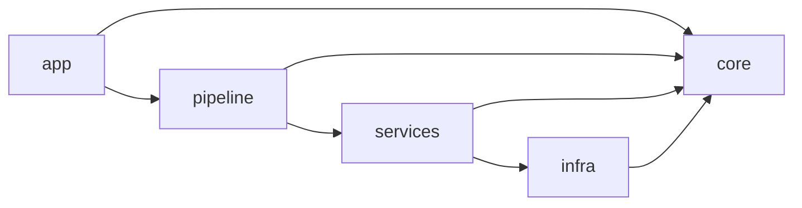
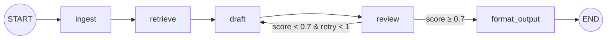

# Architecture Spine — NuevaMente

## Design Paradigm

**Pipeline con separación modular.** LangGraph orquesta un grafo lineal de nodos (el pipeline de transformación), pero cada nodo es un thin wrapper que delega a módulos de dominio independientes del framework. Los módulos se agrupan en capas con dirección de dependencia estricta.



`core` es transversal: importado por todos, no importa a nadie. Contiene schemas Pydantic, tipos de dominio y excepciones.

## Invariants & Rules

### AD-1 — Pipeline como paradigma, módulos como unidades

- **Binds:** todo el sistema
- **Prevents:** lógica de negocio acoplada a LangGraph, nodos gordos imposibles de testear en aislamiento
- **Rule:** Cada nodo del grafo LangGraph es un thin wrapper (< 20 líneas) que llama a una función de `services/`. Nunca contiene lógica de negocio, prompts, ni acceso a infraestructura. La lógica de `services/` es testeable sin LangGraph ni FastAPI.

### AD-2 — Grafo lineal determinista con un solo conditional edge

- **Binds:** FR-7, FR-8, FR-9
- **Prevents:** overhead de supervisor LLM innecesario, latencia extra, complejidad de enrutamiento dinámico
- **Rule:** El grafo es: `START → ingest → retrieve → draft → review → format_output → END`. Un único conditional edge en `review`: si `score < threshold` y `retry_count < max_retries`, re-ruta a `draft` con feedback; si no, continúa a `format_output`. No hay supervisor, no hay sub-grafos, no hay enrutamiento dinámico.



### AD-3 — Estrategia RAG: fast-path + stratified full-coverage retrieval

- **Binds:** FR-7, Open Question 1 del PRD
- **Prevents:** pérdida de contenido en documentos largos, sesgo hacia el inicio del documento, gasto innecesario de llamadas LLM
- **Rule:** Dos caminos por tamaño del documento. **Fast-path** (tokens totales de chunks ≤ `fast_path_token_limit`): todos los chunks pasan directo al Redactor sin retrieval. **Full-coverage** (sobre umbral): (1) section map construido por parsing de estructura del texto — sin LLM, (2) una sola llamada LLM para generar queries sintéticas desde el mapa completo, condicionadas por perfil/formato/nicho, (3) FAISS similarity search por cada query con piso de cobertura por sección — si una sección tiene cero chunks recuperados, se fuerza inclusión de su chunk más representativo, (4) budget total de chunks distribuido proporcionalmente por sección.

### AD-4 — Estado del grafo como contrato entre nodos

- **Binds:** todos los nodos del grafo
- **Prevents:** nodos con side effects, estado implícito, acoplamiento entre nodos
- **Rule:** `NuevaMenteState` es un `TypedDict` con cuatro grupos: Input (inmutable post-ingest: `document_id`, `raw_text`, `file_name`, `perfil`, `formato`, `nicho`), Pipeline (`chunks`, `section_map`, `retrieved_chunks`, `generated_content`), Control (`review_result`, `retry_count`), Output (`educational_package`, `oci_upload_status`). No contiene `messages` (no es chatbot). FAISS no viaja en state — se accede desde `infra/`.

### AD-5 — Dirección de dependencia estricta entre módulos

- **Binds:** todo el código
- **Prevents:** imports circulares, lógica de negocio acoplada a framework
- **Rule:** `app/` → `pipeline/` → `services/` → `infra/` → (ninguno). `core/` es importado por todos. Ningún módulo puede importar un módulo que está a su izquierda en esta cadena. `infra/` no importa `services/`. `pipeline/` no importa `app/`.

### AD-6 — Structured output con Pydantic vía with_structured_output()

- **Binds:** FR-8, FR-10, FR-11, `services/generation.py`, `core/schemas.py`
- **Prevents:** parsing manual de JSON desde texto libre, errores de schema silenciosos, contenido que no cumple la estructura
- **Rule:** El Redactor invoca el LLM con `llm.with_structured_output(ModeloPydantic)` donde el modelo varía por formato pedagógico. Cada formato tiene su propia clase Pydantic (`FlashcardsPaquete`, `QuizPaquete`, `TutorialPaquete`, `ResumenEjecutivoPaquete`, `GuionClasePaquete`) que hereda de `PaqueteEducativoBase`. El LLM devuelve instancias validadas, no texto libre.

### AD-7 — API async con polling de estado

- **Binds:** FR-6, FR-14, FR-18
- **Prevents:** bloqueo de Uvicorn worker durante 2 min, spinner genérico sin feedback real, timeout de browser
- **Rule:** `POST /api/v1/adaptar` retorna HTTP 202 + `task_id` inmediatamente. `GET /api/v1/adaptar/{task_id}/status` retorna el paso actual del pipeline y el resultado final cuando completa. El pipeline corre en background. El estado del task se mantiene en un dict in-process (concurrencia 1, no requiere almacenamiento externo). La UI hace polling para mostrar progreso real por etapa.

### AD-8 — Un índice FAISS por documento

- **Binds:** FR-4, `services/rag.py`, `infra/vectorstore.py`
- **Prevents:** colisión de índices entre documentos, re-embedding redundante, gasto innecesario de API Voyage AI
- **Rule:** Cada documento genera su índice en `data/faiss_indexes/{document_id}/` (`index.faiss` + `index.pkl`). `document_id` = SHA-256 truncado a 16 chars del contenido. Si el índice ya existe, se carga desde disco sin re-generar embeddings.

### AD-9 — OCI Object Storage fire-and-forget

- **Binds:** FR-12, FR-13, FR-20
- **Prevents:** entrega bloqueada por fallo de OCI, pérdida de trazabilidad input→output
- **Rule:** Upload a OCI corre después de entregar el resultado al usuario. Dos prefijos en el bucket: `sources/{document_id}/{filename}` y `packages/{document_id}/{perfil}-{formato}-{timestamp}.json`. Si falla: se loguea, `oci_upload_status = "failed"`, el usuario ya tiene su paquete. El historial (FR-20) lista objetos desde `packages/`.

### AD-10 — Configuración centralizada con pydantic-settings

- **Binds:** NFR-5, todos los módulos
- **Prevents:** configuración dispersa, valores mágicos hardcodeados, credenciales en código
- **Rule:** Un único `config.py` con `class Settings(BaseSettings)`. Toda configuración viene de variables de entorno prefijadas `NM_` o de `.env`. Defaults sensatos para funcionar con solo API keys. Punto único de verdad.

### AD-11 — Despliegue single-process en OCI Always Free

- **Binds:** NFR-1, NFR-3
- **Prevents:** complejidad de proxy innecesaria en v1, costos fuera de Always Free
- **Rule:** Uvicorn directo (sin nginx). systemd para persistencia. Swap 4-8GB obligatorio. FastAPI sirve static files y API desde el mismo proceso. Servicios externos: Google AI API, Voyage AI API, OCI Object Storage. Todo dentro de capas gratuitas.

### AD-12 — Convenciones de naming, IDs, errores y logging [ADOPTED]

- **Binds:** todo el código
- **Prevents:** inconsistencia de naming, IDs colisionables, errores sin contexto
- **Rule:** Ver tabla de convenciones en la sección correspondiente.

## Consistency Conventions

| Concern | Convention |
| --- | --- |
| Naming (archivos, módulos) | `snake_case`. Español para dominio (`paquete_educativo`), inglés para infra (`vectorstore`) |
| Naming (Pydantic models) | `PascalCase` español: `PaqueteEducativo`, `FlashcardItem`, `SolicitudAdaptacion` |
| Naming (endpoints) | `/api/v1/adaptar`, `/api/v1/adaptar/{task_id}/status`, `/api/v1/historial` |
| Data & formats (IDs) | UUID v4 para `task_id`. SHA-256 truncado a 16 chars para `document_id` |
| Data & formats (fechas) | ISO 8601 con timezone: `2026-09-24T18:00:00-03:00` |
| State & cross-cutting (errores API) | JSON: `{"status": "error", "codigo": "FORMATO_NO_SOPORTADO", "mensaje": "..."}` en español |
| State & cross-cutting (logging) | structlog o stdlib a stdout. Nivel INFO default, DEBUG configurable. Cada entrada: `task_id`, `node_name`, `duration_ms` |
| State & cross-cutting (config) | Env vars prefijadas `NM_`. Un solo `Settings` Pydantic en `config.py` |

## Stack

| Name | Version |
| --- | --- |
| Python | 3.12 |
| LangGraph | 1.2.x |
| LangChain Core | latest compatible |
| langchain-voyageai | latest compatible |
| langchain-community (FAISS) | latest compatible |
| langchain-google-genai | latest compatible |
| FAISS (faiss-cpu) | latest compatible |
| FastAPI | 0.141.x |
| Uvicorn | latest compatible |
| Pydantic / pydantic-settings | v2.x |
| OCI Python SDK (oci) | 2.187.x |
| Voyage AI model | voyage-4 |
| LLM | Gemini 3.5 Flash Lite (gemini-3.5-flash-lite) |
| OCI Compute | VM.Standard.E2.1.Micro (1GB RAM, 1 OCPU, Always Free) |

## Structural Seed

```text
nuevamente/
  app/                    # FastAPI surface: routers, static files, lifespan
    main.py               # App factory, mounts routers + static
    routers/
      adaptar.py          # POST /api/v1/adaptar, GET .../status
    static/               # HTML/CSS/JS interfaz web (FR-16 a FR-20)
  core/                   # Pure domain: schemas, types, exceptions
    schemas.py            # Pydantic: PaqueteEducativoBase, *Paquete per format, SolicitudAdaptacion
    models.py             # Enums: Perfil, FormatoPedagogico, Nicho
    exceptions.py         # DocumentoVacio, FormatoNoSoportado, UmbralMemoriaExcedido...
  pipeline/               # LangGraph orchestration — ONLY place LangGraph is imported
    graph.py              # build_graph(): nodes + edges + conditional
    state.py              # NuevaMenteState TypedDict
    nodes/                # Thin wrappers delegating to services
      ingest.py
      retrieve.py
      draft.py
      review.py
      format_output.py
  services/               # Business logic — testable without LangGraph/FastAPI
    ingestion.py          # Text extraction (PDF/MD/TXT), chunking, section map
    rag.py                # Query synthesis, FAISS retrieval, coverage floor
    generation.py         # Prompt construction, LLM invocation (Redactor + Critic)
    storage.py            # OCI Object Storage upload/list (best-effort)
  infra/                  # Infrastructure adapters
    embeddings.py         # VoyageAIEmbeddings init
    vectorstore.py        # FAISS load/save/create
    llm.py                # init_chat_model (Gemini 3.5 Flash Lite)
    oci.py                # OCI SDK client setup
  config.py               # pydantic-settings: Settings(BaseSettings)
data/
  faiss_indexes/          # Per-document FAISS indexes (gitignored)
```

## Capability → Architecture Map

| Capability / FR | Lives in | Governed by |
| --- | --- | --- |
| FR-1, FR-2 (ingestión, extracción) | `services/ingestion.py`, `pipeline/nodes/ingest.py` | AD-1, AD-5 |
| FR-3 (chunking semántico) | `services/ingestion.py` | AD-1, AD-3 |
| FR-4 (embeddings + FAISS) | `infra/embeddings.py`, `infra/vectorstore.py` | AD-8 |
| FR-5 (parámetros de personalización) | `core/models.py`, `core/schemas.py` | AD-6, AD-12 |
| FR-6 (solicitud atómica) | `app/routers/adaptar.py` | AD-7 |
| FR-7 (Agente Investigador RAG) | `services/rag.py`, `pipeline/nodes/retrieve.py` | AD-2, AD-3 |
| FR-8 (Agente Redactor) | `services/generation.py`, `pipeline/nodes/draft.py` | AD-2, AD-6 |
| FR-9 (Agente Crítico) | `services/generation.py`, `pipeline/nodes/review.py` | AD-2, AD-6 |
| FR-10, FR-11 (schema JSON) | `core/schemas.py`, `pipeline/nodes/format_output.py` | AD-6 |
| FR-12, FR-13 (OCI Storage) | `services/storage.py`, `infra/oci.py` | AD-9 |
| FR-14, FR-15 (API REST) | `app/routers/adaptar.py`, `core/exceptions.py` | AD-7, AD-12 |
| FR-16 a FR-20 (Interfaz Web) | `app/static/` | AD-11 |
| NFR-1 (hardware) | `config.py`, deployment | AD-10, AD-11 |
| NFR-4 (observabilidad) | cross-cutting (logging) | AD-12 |
| NFR-5 (mantenibilidad) | module structure | AD-1, AD-5 |

## Deferred

- **Framework de UI avanzado (SPA):** v1 usa HTML/CSS/JS estático. Un framework SPA se evalúa para v2 si la complejidad de la UI lo justifica. No afecta ningún AD — la UI consume la API REST sin acoplamiento.
- **Procesamiento asíncrono real (task queue):** v1 usa dict in-process para tasks. Si se necesita concurrencia >1, migrar a Celery/Redis o similar. No afecta ADs — el contrato API (202 + polling) se mantiene.
- **Score de fidelidad robusto (embeddings-based):** v1 usa autoevaluación LLM. Método por comparación de embeddings (fuente vs generado) queda para v2. Impactaría AD-2 (nodo review) pero no otros.
- **Observabilidad avanzada (LangSmith):** v1 usa logging a stdout. LangSmith se integra cuando haya presupuesto/necesidad. No afecta ADs — LangGraph es compatible out-of-the-box.
- **Nginx / reverse proxy:** v1 sirve directo con Uvicorn. Se agrega nginx si se necesita TLS termination, rate limiting, o static file caching. No afecta ADs.
- **Estrategia de retry para APIs externas:** Rate limiting y retry policy para Gemini/Voyage AI. Se define en implementación — probablemente tenacity con backoff exponencial.
- **Timeout de solicitud:** Valor concreto del timeout máximo (sugerido 3 min en PRD). Se define en implementación.
- **Límite de tamaño de documento:** Detección proactiva de documentos que generarían índices demasiado grandes. Se define en implementación con pre-check de tamaño estimado.
