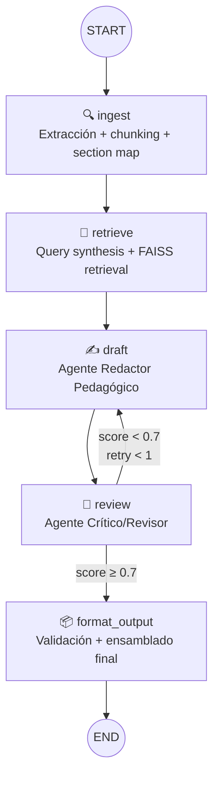
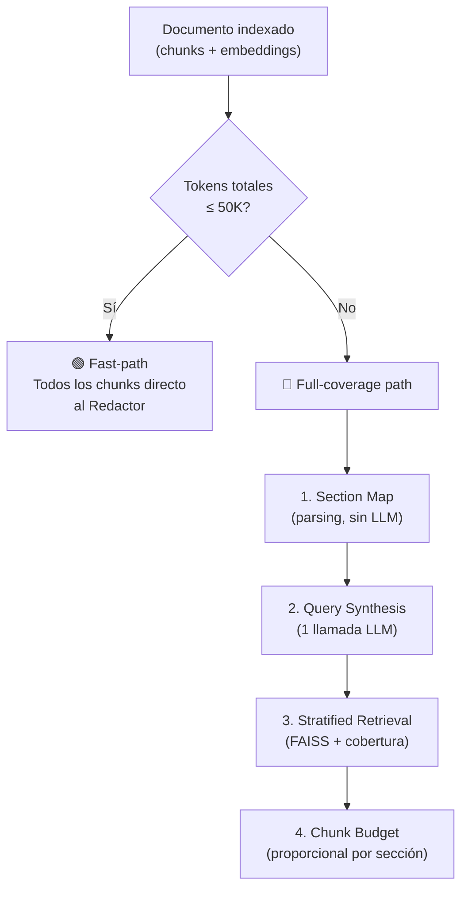
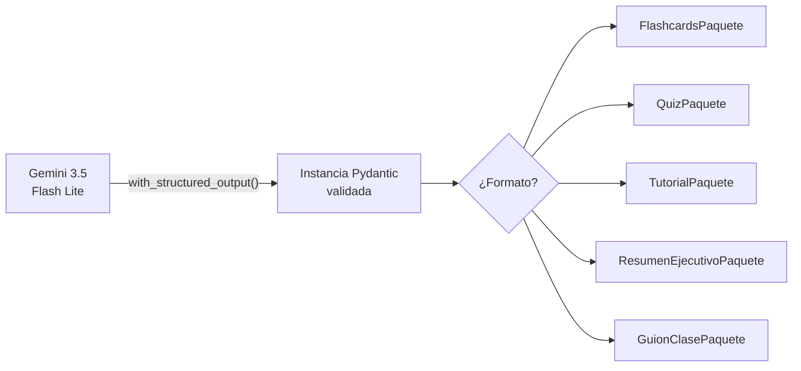
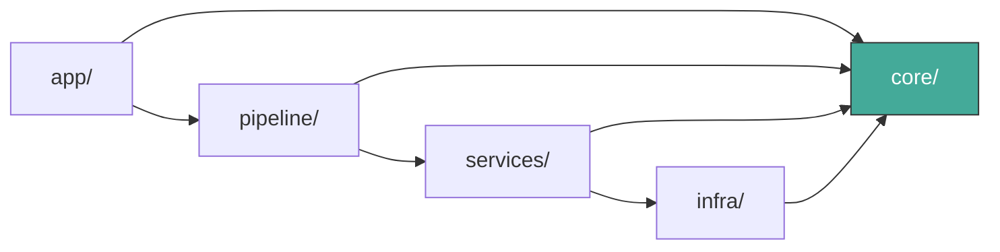
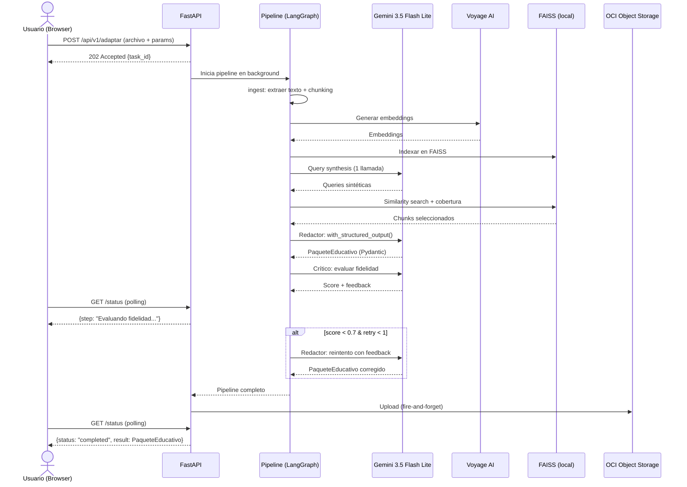
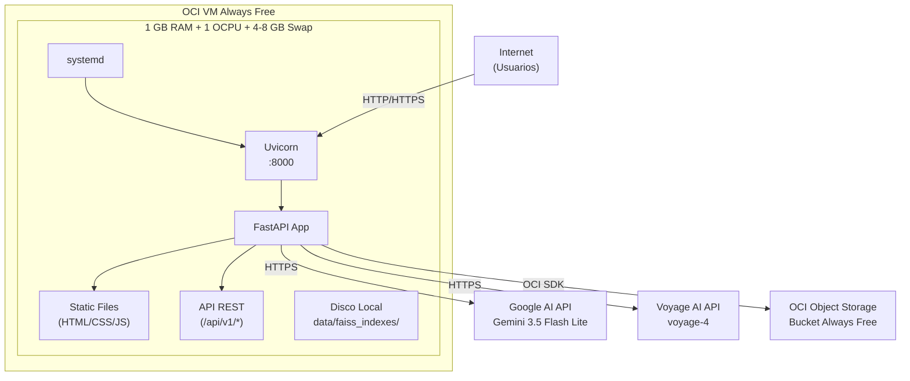

# Arquitectura del Sistema — NuevaMente

## 1. Visión General

NuevaMente es un sistema de transformación de documentación técnica en contenido educativo personalizado. Recibe un documento fuente (PDF, Markdown o texto plano), tres parámetros de personalización (perfil del destinatario, formato pedagógico, nicho/contexto), y produce un paquete educativo JSON estructurado con contenido adaptado, metadatos pedagógicos y un score de fidelidad al documento original.

El sistema se distingue de un chatbot RAG convencional en un punto fundamental: **no hay pregunta del usuario**. El input es un documento completo y la salida es un producto educativo nuevo — una transformación, no una conversación.

## 2. Paradigma de Diseño

**Pipeline con separación modular.**

El sistema sigue un paradigma de pipeline: los datos fluyen por etapas de transformación en orden determinista. La orquestación del pipeline la provee LangGraph (grafos de estado), pero cada nodo del grafo es un wrapper delgado que delega la lógica real a módulos de dominio independientes del framework.

Esta separación permite:
- Testear la lógica de negocio sin LangGraph ni FastAPI
- Reemplazar cualquier componente de infraestructura sin tocar los demás
- Entender el sistema leyendo el grafo (alto nivel) o los módulos (detalle)

## 3. Arquitectura del Pipeline

### 3.1 Grafo de Procesamiento

El pipeline se modela como un grafo lineal de LangGraph con un único punto de decisión: el loop de corrección del Agente Crítico.



### 3.2 Descripción de Nodos

| Nodo | Agente | Qué hace | Input del State | Output al State |
|------|--------|----------|-----------------|-----------------|
| `ingest` | — | Extrae texto del documento, lo segmenta en chunks semánticos, construye el mapa de secciones | `raw_text`, `file_name` | `chunks`, `section_map`, `document_id` |
| `retrieve` | Agente Investigador RAG | Genera queries sintéticas adaptadas al perfil/formato/nicho, ejecuta búsqueda en FAISS con cobertura garantizada por sección | `chunks`, `section_map`, `perfil`, `formato`, `nicho` | `retrieved_chunks` |
| `draft` | Agente Redactor Pedagógico | Transforma los chunks en contenido educativo usando `with_structured_output()` para generar Pydantic tipado | `retrieved_chunks`, `perfil`, `formato`, `nicho`, `review_result` (si reintento) | `generated_content` |
| `review` | Agente Crítico/Revisor | Evalúa fidelidad del contenido vs documento fuente, calcula `anclaje_fuente_score` | `generated_content`, `retrieved_chunks` | `review_result`, `retry_count` |
| `format_output` | — | Ensambla el paquete educativo final con metadatos y evaluación | `generated_content`, `review_result` | `educational_package` |

### 3.3 Estado del Grafo

```python
class NuevaMenteState(TypedDict):
    # Input (inmutable post-ingest)
    document_id: str
    raw_text: str
    file_name: str
    perfil: str          # Perfil del Destinatario
    formato: str         # Formato Pedagógico
    nicho: str           # Nicho/Contexto

    # Pipeline intermedio
    chunks: list[dict]           # Chunks con metadata (section_id, position, header)
    section_map: list[dict]      # Mapa de secciones del documento
    retrieved_chunks: list[dict] # Chunks seleccionados por retrieval
    generated_content: dict      # Output del Redactor (Pydantic serializado)

    # Control de flujo
    review_result: dict          # Score + feedback del Crítico
    retry_count: int             # Reintentos realizados (max 1)

    # Output
    educational_package: dict    # Paquete Educativo final (JSON validado)
    oci_upload_status: dict      # Status del upload a OCI
```

## 4. Estrategia RAG: Full-Coverage Retrieval

### 4.1 El Problema

NuevaMente no es un chatbot — no hay pregunta del usuario que sirva como query de búsqueda. El sistema debe cubrir el **documento completo** para transformarlo en contenido educativo. Esto requiere una estrategia de retrieval que garantice cobertura total, sin importar el tamaño del documento.

### 4.2 Dos Caminos por Tamaño



**Fast-path:** Para documentos cortos (≤ ~50K tokens en chunks), todos los chunks pasan directamente al Redactor. No se necesita retrieval — el documento cabe en el contexto del LLM (1M tokens). FAISS se usa después para el score de fidelidad.

**Full-coverage path:** Para documentos largos:

1. **Section Map (sin LLM):** Se construye un mapa de secciones del documento completo mediante parsing de estructura del texto (encabezados, separadores, marcadores). Cada chunk queda etiquetado con su sección. El mapa es compacto (~1-2 páginas incluso para documentos de 500 páginas).

2. **Query Synthesis (1 llamada LLM):** Se pasa el mapa de secciones compacto (headers + primera oración por sección) al LLM junto con el perfil, formato y nicho. El LLM genera queries sintéticas distribuidas a lo largo de todo el documento, adaptadas al tipo de contenido educativo que se va a generar.

3. **Stratified Retrieval (FAISS + cobertura):** Se ejecuta similarity search por cada query. Se aplica un **piso de cobertura**: si alguna sección del documento tiene cero chunks recuperados, se fuerza la inclusión de su chunk más representativo (centroide de embeddings).

4. **Chunk Budget:** El total de chunks se limita por contexto del LLM, distribuido proporcionalmente por sección — una sección de 50 chunks aporta más representantes que una de 5.

### 4.3 Consumo de API por Request

| Paso | Llamadas LLM | Tokens estimados |
|------|-------------|------------------|
| Section map | 0 (parsing local) | 0 |
| Query synthesis | 1 | ~4K |
| Redactor | 1 | ~43K |
| Crítico | 1 | ~47K |
| Reintento (condicional) | 0-1 | ~48K |
| **Total** | **3-4** | **~94K-142K** |

Dentro del presupuesto del tier gratuito de Gemini 3.5 Flash Lite (15 RPM, 250K TPM, 500 RPD).

## 5. Structured Output

El Redactor genera paquetes educativos usando `llm.with_structured_output(ModeloPydantic)` — el LLM devuelve directamente instancias Pydantic validadas, no texto libre que requiera parsing.



Cada formato pedagógico tiene su propio modelo Pydantic que hereda de `PaqueteEducativoBase`. La validación de schema es inherente a la llamada al LLM, no un paso posterior.

## 6. Estructura del Proyecto

```
nuevamente/
├── app/                          # Superficie de entrada — FastAPI
│   ├── main.py                   # App factory, lifespan, monta routers + static
│   ├── routers/
│   │   └── adaptar.py            # POST /api/v1/adaptar, GET .../status, GET .../historial
│   └── static/                   # HTML/CSS/JS interfaz web
│
├── core/                         # Dominio puro — sin dependencias de framework
│   ├── schemas.py                # Pydantic: PaqueteEducativoBase, *Paquete por formato
│   ├── models.py                 # Enums: Perfil, FormatoPedagogico, Nicho
│   └── exceptions.py             # Excepciones de dominio
│
├── pipeline/                     # Orquestación — LangGraph vive SOLO aquí
│   ├── graph.py                  # build_graph(): define nodos y edges
│   ├── state.py                  # NuevaMenteState (TypedDict)
│   └── nodes/                    # Nodos thin — delegan a services
│       ├── ingest.py
│       ├── retrieve.py
│       ├── draft.py
│       ├── review.py
│       └── format_output.py
│
├── services/                     # Lógica de negocio — testeable sin frameworks
│   ├── ingestion.py              # Extracción texto, chunking, section map
│   ├── rag.py                    # Query synthesis, FAISS retrieval, cobertura
│   ├── generation.py             # Prompts, invocación LLM, structured output
│   └── storage.py                # OCI Object Storage (best-effort)
│
├── infra/                        # Adaptadores de infraestructura
│   ├── embeddings.py             # VoyageAIEmbeddings
│   ├── vectorstore.py            # FAISS load/save/create
│   ├── llm.py                    # init_chat_model (Gemini 3.5 Flash Lite)
│   └── oci.py                    # OCI SDK client
│
├── config.py                     # pydantic-settings centralizado
└── __init__.py

data/
└── faiss_indexes/                # Índices FAISS por documento (gitignored)
    └── {document_id}/
        ├── index.faiss
        └── index.pkl
```

### Regla de Dependencia



`core/` es transversal: importado por todos, no importa a nadie.

## 7. API REST

### 7.1 Endpoints

| Método | Endpoint | Descripción | Response |
|--------|----------|-------------|----------|
| `POST` | `/api/v1/adaptar` | Envía documento + parámetros, inicia pipeline | `202 Accepted` + `{"task_id": "..."}` |
| `GET` | `/api/v1/adaptar/{task_id}/status` | Consulta estado/resultado del pipeline | `200` + estado actual o paquete final |
| `GET` | `/api/v1/historial` | Lista generaciones anteriores | `200` + lista de paquetes desde OCI |
| `GET` | `/docs` | Documentación OpenAPI auto-generada | Swagger UI |

### 7.2 Flujo de una Solicitud



## 8. Infraestructura de Despliegue



### Especificaciones

| Componente | Especificación |
|------------|---------------|
| **Compute** | OCI VM.Standard.E2.1.Micro — 1 GB RAM, 1 OCPU, Always Free |
| **Memoria efectiva** | ~5-9 GB (1 GB RAM + 4-8 GB Swap) |
| **OS** | Ubuntu (mismo que raggraph) |
| **Proceso** | Uvicorn directo, gestionado por systemd |
| **Concurrencia** | 1 (un request a la vez) |
| **Almacenamiento** | Disco local para FAISS + OCI Object Storage para persistencia |
| **Costo** | $0 — todo dentro de Always Free |

## 9. Stack Tecnológico

| Componente | Tecnología | Versión | Justificación |
|------------|-----------|---------|---------------|
| Lenguaje | Python | 3.12 | Ecosistema ML/AI, requisito hackathon |
| Orquestación | LangGraph | 1.2.x | Grafos de estado con conditional edges, feedback loops |
| LLM | Gemini 3.5 Flash Lite | — | Free tier más generoso (15 RPM, 250K TPM, 500 RPD), 1M contexto |
| Embeddings | Voyage AI (voyage-4) | — | Calidad superior para retrieval, 32K contexto, shared embedding space |
| Vector Store | FAISS (faiss-cpu) | — | Bajo consumo de memoria (~10x menor que ChromaDB), probado en 1 GB RAM |
| Schemas | Pydantic v2 | — | Tipado estricto + structured output del LLM + validación API |
| API | FastAPI | 0.141.x | Async, OpenAPI auto-generada, integración nativa Pydantic |
| Persistencia | OCI Object Storage | — | Requisito obligatorio hackathon (Always Free) |
| Config | pydantic-settings | — | Env vars tipadas con defaults |
| Server | Uvicorn | — | ASGI, producción ligera |
| OCI SDK | oci | 2.187.x | SDK oficial para Object Storage |
