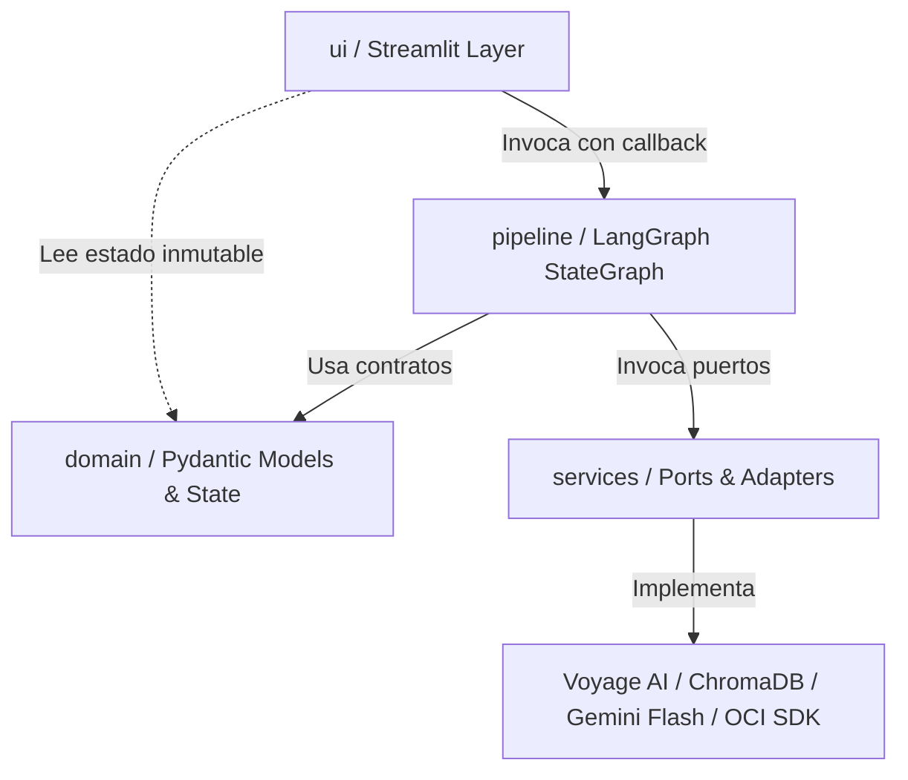
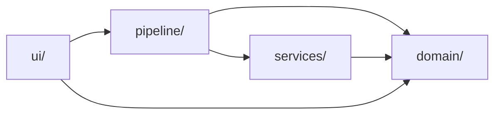

# Architecture Spine — NuevaMente

## Design Paradigm

El sistema adopta **Puertos y Adaptadores (Hexagonal) desacoplado con Orquestación por Grafo de Estados (LangGraph StateGraph)**.



- **`domain/` (Núcleo):** Contratos puros de datos tipados con Pydantic v2 y el `PipelineGraphState` para LangGraph. Inmutable, sin dependencias de I/O ni frameworks.
- **`services/` (Puertos y Adaptadores):** Clientes de infraestructura aislados (`IngestionService`, `VoyageEmbeddingService`, `ChromaVectorStoreService`, `LLMFactory`, `StoragePort`).
- **`pipeline/` (Orquestador de Flujo):** Grafo de estados (`StateGraph`) que ejecuta secuencialmente los nodos y gestiona la arista condicional de auto-reflexión / reintento.
- **`ui/` (Presentación):** Vistas y widgets puros de Streamlit. No realiza I/O directo con APIs externas.

---

## Invariants & Rules

### Diagrama de Dirección de Dependencias



*Regla:* Las dependencias apuntan exclusivamente hacia `domain/` y `services/`. El paquete `domain/` no depende de ningún otro módulo del proyecto. `services/` no conoce la `ui/` ni el `pipeline/`.

---

### AD-1 — Orquestación del Pipeline mediante LangGraph StateGraph
- **Binds:** FR-3, FR-5, FR-6, FR-8, FR-9, FR-10, FR-13
- **Prevents:** Acoplamiento de lógica RAG en scripts imperativos monolíticos y reintentos manuales desordenados.
- **Rule:** El pipeline de generación debe implementarse exclusivamente como un `StateGraph` de LangGraph compuesto por 5 nodos (`ingest`, `retrieve`, `generate`, `evaluate`, `persist`). El paso de estado entre nodos se realiza a través de un `TypedDict` tipado (`PipelineGraphState`). La UI consume el grafo mediante `graph.stream()` para notificar progreso en tiempo real a `st.status()`.

### AD-2 — Ciclo de Auto-Reflexión para Mitigación de Alucinaciones
- **Binds:** FR-9, SM-1, SM-2
- **Prevents:** Salidas con alucinaciones o contenido no sustentado en la documentación técnica que degraden la puntuación ante el jurado.
- **Rule:** El nodo `evaluate` debe invocar un evaluador LLM a `temperature=0.0` contra los chunks recuperados emitiendo `anclaje_fuente_score` (0.0 a 1.0). Se define una arista condicional (`conditional_edge`): si `anclaje_fuente_score < umbral` (0.85 para perfiles técnicos, 0.80 para ejecutivos) y `retry_count < 2`, el grafo transiciona nuevamente a `generate` inyectando las observaciones de discrepancia para auto-corrección; de lo contrario, transiciona a `persist`.
- **Riesgo Documentado [RISK-AD2]:** El juez LLM y el generador comparten el mismo modelo base (Gemini Flash). Esto introduce sesgo de auto-evaluación: el juez puede no detectar alucinaciones que el propio modelo generó con alta confianza. Mitigación parcial: `temperature=0.0` y prompt de auditoría explícito basado en chunks. Mitigación futura (v2): reemplazar el juez por similitud coseno Voyage AI entre contenido generado y chunks recuperados para evaluación independiente del proveedor LLM.

### AD-3 — Contrato Estricto Pydantic v2 en Generación Estructurada
- **Binds:** FR-8, SM-2
- **Prevents:** Errores de parseo JSON o contratos rotos entre backend y componentes de visualización.
- **Rule:** La generación en `generate` debe utilizar `llm.with_structured_output(EducationalContentPackage)`. Ningún nodo ni vista de la UI debe manipular JSONs desestructurados o diccionarios sin tipar. Todo paquete generado debe ser una instancia validada de `EducationalContentPackage`.

### AD-4 — Aislamiento de Estado en Streamlit y Evitación de Re-ejecución
- **Binds:** FR-12, FR-13, FR-14
- **Prevents:** Pérdida de estado generado o re-ejecución accidental del pipeline RAG al interactuar con widgets (flip de flashcards, responder quizzes, cambiar pestañas).
- **Rule:** El resultado del pipeline se almacena en `st.session_state["active_package"]` como única fuente de verdad para la renderización. Los clientes pesados (`ChromaVectorStoreService`, `StoragePort`, `LLMFactory`) deben instanciarse y mantenerse mediante `@st.cache_resource`. Los botones interactivos de visualización solo mutan flags locales de UI sin re-invocar el grafo.
- **Convención de Retry en UI:** Durante un ciclo de auto-reflexión (AD-2), el paso de "Generación Didáctica" en `st.status()` se actualiza con el sufijo ` (reintento N/2)` sin destruir ni recrear el componente de estado. El paso no avanza a "Evaluación de Fidelidad" hasta que el nodo `generate` complete el reintento. La transición al siguiente paso siempre se realiza hacia adelante; nunca se retrocede visualmente en la barra de progreso.

### AD-5 — Aislamiento y Caché Semántico en ChromaDB por Document Hash
- **Binds:** FR-4, FR-5, NFR-8.3
- **Prevents:** Contaminación cruzada de fragmentos entre documentos técnicos diferentes y consumo innecesario de cuota en Voyage AI al re-procesar el mismo archivo.
- **Rule:** Cada documento subido se identifica por su hash SHA-256 (`doc_{sha256[:12]}`). El hash **debe calcularse sobre el texto extraído y normalizado** (post-limpieza FR-2), no sobre los bytes crudos del archivo original. Esto garantiza que el mismo documento técnico con metadatos o codificaciones distintas (e.g. mismo PDF re-exportado) mapee a la misma colección. La colección en ChromaDB se crea/obtiene con dicho nombre. Si la colección ya contiene vectores, se omite la extracción y embedding con Voyage AI, reutilizando el índice existente de forma inmediata.

### AD-6 — Puerto de Almacenamiento Dual (OCI Always Free / Mock Local)
- **Binds:** FR-10, FR-11, SM-3
- **Prevents:** Dependencia obligatoria de credenciales OCI en entornos locales de desarrollo y colapso de la aplicación si no hay conexión a Oracle Cloud.
- **Rule:** La persistencia se realiza mediante la interfaz `StoragePort`. Si la variable de entorno `OCI_MOCK=true` o las credenciales de OCI no están presentes, se activa automáticamente `MockLocalStorageAdapter`, que escribe en `./mock_oci_storage/<bucket>/<objeto_id>` y emite `status_upload="mock_local"`. Si están configuradas, `OCIObjectStorageAdapter` persiste en OCI Object Storage Always Free emitiendo `status_upload="completado"`. Ambos adaptadores satisfacen idéntico esquema Pydantic `AlmacenamientoOCIInfo`.

### AD-7 — Abstracción LLM compatible con OpenAI API y Gemini Flash Default
- **Binds:** FR-7
- **Prevents:** Acoplamiento rígido con el SDK propietario de un único proveedor de IA.
- **Rule:** El servicio `LLMFactory` debe instanciar modelos usando el protocolo estándar de OpenAI Chat Completions API (`/v1/chat/completions`), configurado por defecto con Google Gemini Flash. El cambio a cualquier proveedor alternativo (Ollama local, OpenAI, Mistral) se realiza únicamente modificando variables de entorno (`LLM_PROVIDER`, `LLM_BASE_URL`, `LLM_MODEL`, `LLM_API_KEY`) sin alterar una sola línea del código de negocio.

---

## Consistency Conventions

| Concern | Convention |
| --- | --- |
| Naming (Clases/Interfaces) | PascalCase para modelos y adaptadores (`EducationalContentPackage`, `StoragePort`, `OCIObjectStorageAdapter`). |
| Naming (Archivos y Nodos) | snake_case para módulos y funciones (`ingest_node`, `generate_node`, `vector_store.py`). |
| Data & Formatos | Fechas y marcas temporales en ISO-8601 UTC. Identificadores de objetos con formato `<formato>-<perfil_slug>-<timestamp>.json`. |
| Esquema de Errores | Los errores de servicios se capturan y transforman en excepciones de dominio (`ExtractionError`, `EmbeddingRateLimitError`, `FidelityThresholdError`), presentados amigablemente en `st.status()` sin volcar stack traces. |
| Gestión de Secretos | Claves de API (`GEMINI_API_KEY`, `VOYAGE_API_KEY`, credenciales OCI) cargadas vía `core/config.py` desde `.env` o `st.secrets`. Prohibido commit de credenciales. |

---

## Stack

| Name | Version |
| --- | --- |
| Python | 3.12 |
| Streamlit | >= 1.38.0 |
| LangGraph | >= 0.2.0 |
| LangChain Core | >= 0.3.0 |
| LangChain Google GenAI / OpenAI | >= 2.0.0 / >= 0.2.0 |
| Voyage AI (`voyageai`) | >= 0.2.3 |
| ChromaDB | >= 0.5.5 |
| Pydantic | >= 2.8.0 |
| PyPDF / PDFPlumber | >= 4.3.0 |
| OCI Python SDK (`oci`) | >= 2.130.0 |
| Python Dotenv | >= 1.0.1 |

---

## Structural Seed

```text
G10-Equipo42-Contenido-Educativo/
├── app.py                      # Punto de entrada de Streamlit (Runner y Layout)
├── core/
│   ├── config.py               # Settings (Pydantic BaseSettings, .env)
│   └── logging.py              # Logging estructurado y trazabilidad
├── domain/                     # Invariantes y Contratos de Datos (Pydantic v2)
│   ├── models.py               # EducationalContentPackage, Flashcard, Quiz, etc.
│   └── state.py                # TypedDict PipelineGraphState
├── services/                   # Puertos y Adaptadores de infraestructura
│   ├── ingestion.py            # Extracción y limpieza (PDF, Markdown, TXT)
│   ├── embeddings.py           # Voyage AI Client (voyage-multilingual-2, 1024d)
│   ├── vector_store.py         # ChromaDB Collection Manager y Búsqueda Semántica
│   ├── llm_factory.py          # Factoría de clientes LLM (OpenAI-compatible)
│   └── storage.py              # StoragePort, OCIObjectStorageAdapter, MockLocalStorageAdapter
├── pipeline/                   # Orquestador del Grafo (LangGraph)
│   ├── graph.py                # Definición del StateGraph y aristas condicionales
│   ├── nodes.py                # Implementación de los 5 nodos del pipeline
│   └── prompts.py              # Templates de prompts didácticos y de fidelidad
├── ui/                         # Vistas y Componentes puros de Streamlit
│   ├── components.py           # Selectores, FileUploader y barra st.status
│   └── views/
│       ├── flashcards.py       # Render de baraja didáctica con flip
│       ├── quiz.py             # Render de cuestionario con justificaciones
│       ├── tutorial.py         # Render de guía práctica y código
│       └── executive.py        # Render de resumen ejecutivo TL;DR
├── mock_oci_storage/           # Almacenamiento local emulado
├── tests/                      # Tests unitarios de nodos y adaptadores
└── pyproject.toml
```

---

## Capability → Architecture Map

| Capability / Requisito PRD | Implementado en | Gobernado por |
| --- | --- | --- |
| FR-1, FR-2: Ingesta y Limpieza Multiformato | `services/ingestion.py`, `pipeline/nodes.py:ingest_node` | AD-1, AD-5 |
| FR-3, FR-4, FR-5: RAG con Voyage AI y ChromaDB | `services/embeddings.py`, `services/vector_store.py`, `pipeline/nodes.py:retrieve_node` | AD-1, AD-5, Stack |
| FR-6, FR-7: Parametrización y Abstracción LLM | `services/llm_factory.py`, `pipeline/prompts.py` | AD-7 |
| FR-8: Generación Estructurada y Tipada | `domain/models.py`, `pipeline/nodes.py:generate_node` | AD-3 |
| FR-9: Evaluación y Mitigación de Alucinaciones | `pipeline/nodes.py:evaluate_node`, `pipeline/graph.py` | AD-2 |
| FR-10, FR-11: Persistencia OCI Always Free y Mock | `services/storage.py`, `pipeline/nodes.py:persist_node` | AD-6 |
| FR-12, FR-13, FR-14: UI Streamlit y Progreso Real | `app.py`, `ui/components.py`, `ui/views/` | AD-1, AD-4 |

---

## Deferred

| Decisión Pospuesta | Razón para diferir |
| --- | --- |
| Despliegue en VM OCI Compute Instance | Excede el alcance del MVP local; documentado como opcional en PRD 6.2. |
| Multi-tenancy y Autenticación de Usuarios (OAuth/SSO) | El MVP opera en sesión interactiva sin login por definición del Hackathon. |
| Ingesta multimodal de diagramas con modelos de visión | Requiere pipeline de embeddings multimodales; diferido a v2. |
| Exportación directa a mazos Anki (.apkg) | Formato JSON descargable cubre la integración para el MVP. |
