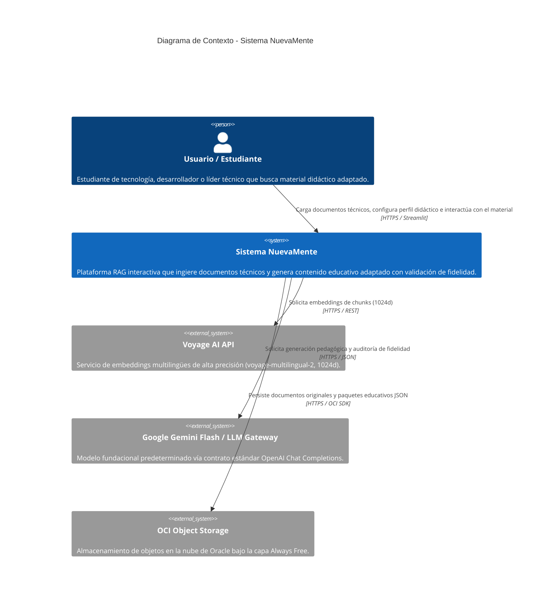
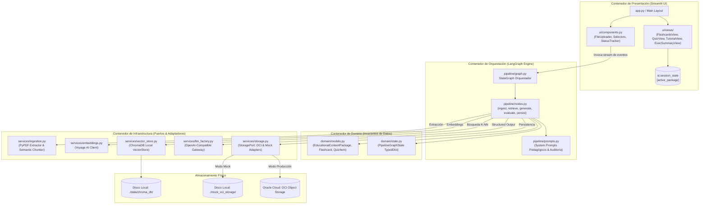
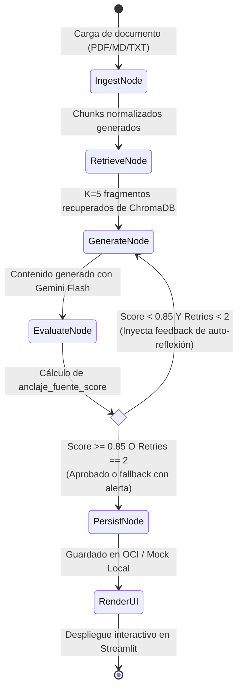
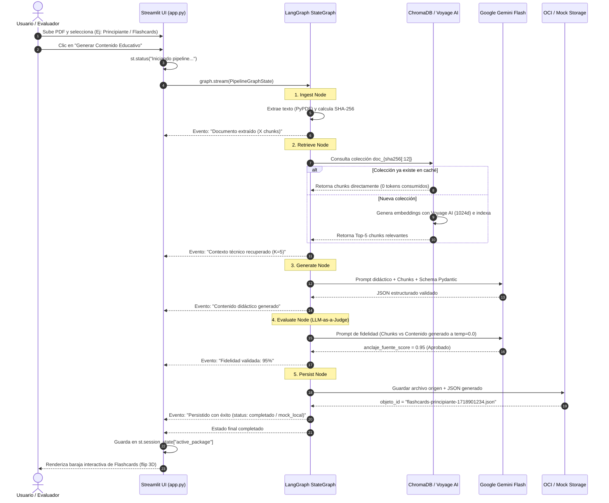
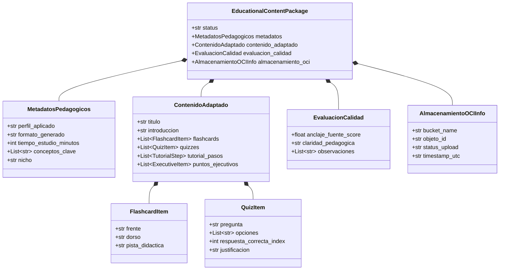

# Documento de Diseño de Solución Técnica — NuevaMente
**Hackathon ONE G10 (Oracle Next Education & Alura)**  
**Proyecto:** NuevaMente – Sistema Inteligente de Adaptación y Generación de Contenido Educativo  
**Arquitecto:** Winston 🏗️ | **Fecha:** 2026-09-22 | **Estado:** Final

---

## 1. Resumen Ejecutivo y Propósito de la Solución

**NuevaMente** resuelve la brecha de accesibilidad del conocimiento técnico denso mediante un pipeline inteligente de **Retrieval-Augmented Generation (RAG)** orquestado con **LangGraph** y presentado mediante una interfaz interactiva en **Streamlit**. 

El sistema transforma manuales y especificaciones técnicas (PDF, Markdown, texto) en cuatro formatos didácticos adaptados a cuatro perfiles pedagógicos ortogonales, garantizando:
1. **Fidelidad Absoluta a la Fuente:** Verificación cuantitativa de anclaje semántico (`anclaje_fuente_score`) y ciclo automatizado de auto-reflexión (mitigación activa de alucinaciones).
2. **Cero Costo en Nube:** Persistencia de artefactos y fuentes exclusivamente en la capa **Always Free de Oracle Cloud Infrastructure (OCI Object Storage)**, complementado con un modo Mock Local determinístico para desarrollo y evaluación ágil.
3. **Contratos Estrictos:** Modelado exhaustivo mediante **Pydantic v2** que elimina fallos de tipado o parseo en el 100% de las respuestas.

---

## 2. Diagramas de Arquitectura (Modelo C4)

### 2.1 C4 Nivel 1: Diagrama de Contexto del Sistema

Muestra cómo interactúan los usuarios y los sistemas externos con **NuevaMente**.

---

### 2.2 C4 Nivel 2: Diagrama de Contenedores y Módulos

Detalla la organización interna de los componentes del software y cómo fluyen los datos entre ellos.

---

## 3. Máquina de Estados del Pipeline (LangGraph StateGraph)

El corazón de la solución es un grafo cíclico de estados gobernado por **LangGraph**, que formaliza las 5 etapas del PRD y gestiona la arista condicional de reintento para mitigación de alucinaciones.

### Definición del Estado del Grafo (`PipelineGraphState`)
El estado muta a través de los nodos mediante un contrato tipado:
- `documento_bytes`: Bytes en memoria del archivo cargado.
- `nombre_archivo`: Nombre y formato original.
- `perfil_destinatario`: Selección pedagógica (Principiante, Junior, Arquitecto, Ejecutivo).
- `formato_salida`: Tipo de material (Flashcards, Quiz, Tutorial, Resumen).
- `nicho_aplicacion`: Contexto temático (Fintech, Salud, E-commerce, General).
- `nivel_detalle`: Didáctico, Técnico o Conciso.
- `chunks_recuperados`: Lista de strings con los fragmentos de mayor similitud semántica.
- `paquete_educativo`: Instancia validada de `EducationalContentPackage`.
- `evaluacion_fidelidad`: Objeto `EvaluacionCalidad` con score cuantitativo y observaciones.
- `retry_count`: Entero incremental (máximo 2) que previene bucles infinitos.
- `almacenamiento_info`: Metadatos de OCI (`bucket`, `objeto_id`, `status_upload`).

---

## 4. Diagrama de Secuencia de Extremo a Extremo

Ilustra la interacción cronológica entre el usuario, la interfaz de Streamlit, el orquestador de LangGraph y los servicios externos.

---

## 5. Modelo de Datos y Contratos Pydantic v2

El sistema enforcea tipado estricto en todos los niveles. No existen diccionarios libres en la capa de generación ni en las vistas.

---

## 6. Estrategia de Entornos y Resiliencia

### 6.1 Modo Híbrido OCI / Mock Local
- **Producción / Demo Oficial:** Configurando `OCI_CONFIG_FILE` o variables de tenancy, el adaptador `OCIObjectStorageAdapter` persiste en Oracle Cloud Always Free emitiendo `status_upload="completado"`.
- **Desarrollo / Offline:** Si `OCI_MOCK=true`, el adaptador `MockLocalStorageAdapter` persiste en `./mock_oci_storage/{bucket}/{objeto_id}` emitiendo `status_upload="mock_local"`. Esto permite a cualquier evaluador clonar el repositorio y ejecutar la aplicación al 100% de sus capacidades sin requerir cuenta en Oracle Cloud.

### 6.2 Manejo de Cuotas y Rate Limits
- **Voyage AI & Gemini Flash:** Implementación de retries automáticos con retroceso exponencial (`tenacity`) ante respuestas `HTTP 429` (Too Many Requests).
- **Caché Vectorial:** Al asociar cada colección a `doc_{sha256[:12]}`, si un evaluador prueba repetidamente un mismo archivo PDF durante la presentación, el sistema no realiza ninguna llamada a Voyage AI, reduciendo la latencia a menos de 500 ms y protegiendo la cuota de la API.

---

## 7. Mapeo a Criterios de Evaluación del Hackathon

| Criterio del Jurado | Solución Arquitectónica Implementada | Evidencia Observable en la Demo |
|---|---|---|
| **Arquitectura RAG & Fidelidad Técnica** | Voyage AI (1024d) + ChromaDB + Evaluador de Fidelidad con auto-reflexión en LangGraph. | Métrica visible en UI (`anclaje_fuente_score` ≥ 0.85) e historial de auto-corrección. |
| **Uso Efectivo de Oracle Cloud (OCI)** | Persistencia en OCI Object Storage Always Free sin costo con trazabilidad de `objeto_id`. | Panel lateral con confirmación de persistencia y enlace al bucket de contenidos. |
| **Integridad de Contratos JSON** | Generación estructurada con Pydantic v2 vía `with_structured_output`. | Descarga de JSON válido 100% conforme a las directivas del concurso. |
| **Experiencia de Usuario (UI/UX)** | Streamlit con `st.status()` reactivo y vistas especializadas (Flashcards con flip, quizzes con feedback). | Visualización interactiva rica según el formato pedagógico seleccionado. |
